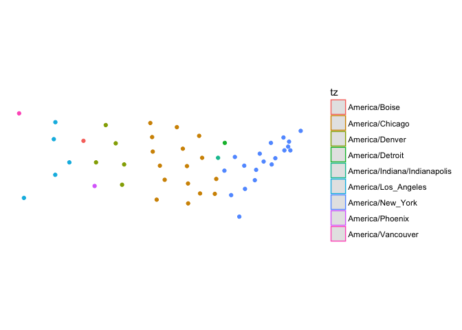
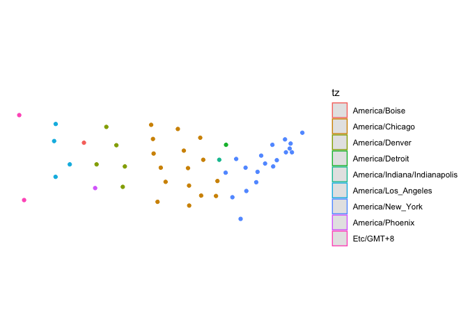

<!-- README.md is generated from README.Rmd. Please edit that file -->
[](https://travis-ci.org/ateucher/lutz) [](https://ci.appveyor.com/project/ateucher/lutz) [](https://codecov.io/github/ateucher/lutz?branch=master)

lutz (look up timezones)
========================

Input latitude and longitude values or an `sf` or `sfc` POINT object and get back the timezone in which they exist. This package uses the **V8** package to access the [`tz-lookup.js` javascript library](https://github.com/darkskyapp/tz-lookup/).

Installation
------------

You can install lutz from github with:

``` r
# install.packages("devtools")
devtools::install_github("ateucher/lutz")
```

Example
-------

There are only two functions in this package: `tz_lookup()` which works with both `sf/sfc` and `SpatialPoints` objects, and `tz_lookup_coords` for looking up lat/long pairs.

### With coordinates. They must be lat/long in decimal degrees:

``` r
library(lutz)
tz_lookup_coords(49.5, -123.5)
#> [1] "America/Vancouver"

tz_lookup_coords(lat = c(48.9, 38.5, 63.1, -25), lon = c(-123.5, -110.2, -95.0, 130))
#> [1] "America/Vancouver"    "America/Denver"       "America/Rankin_Inlet"
#> [4] "Australia/Darwin"
```

### With `sf` objects:

``` r
library(sf)
library(ggplot2) # this requires the devlopment version of ggplot2

# Create an sf object out of the included state.center dataset:
pts <- lapply(seq_along(state.center$x), function(i) {
  st_point(c(state.center$x[i], state.center$y[i]))
})
state_centers_sf <- st_sf(st_sfc(pts))

# Use tz_lookup_sf to find the timezones
state_centers_sf$tz <- tz_lookup(state_centers_sf)

ggplot() + 
  geom_sf(data = state_centers_sf, aes(colour = tz)) + 
  theme_minimal() + 
  coord_sf(datum = NA)
```



### With `SpatialPoints` objects:

``` r
library(sp)
state_centers_sp <- as(state_centers_sf, "Spatial")

state_centers_sp$tz <- tz_lookup(state_centers_sp)

ggplot(cbind(as.data.frame(coordinates(state_centers_sp)), tz = state_centers_sp$tz), 
       aes(x = coords.x1, y = coords.x2, colour = tz)) + 
  geom_point() + 
  coord_fixed() + 
  theme_minimal()
```


