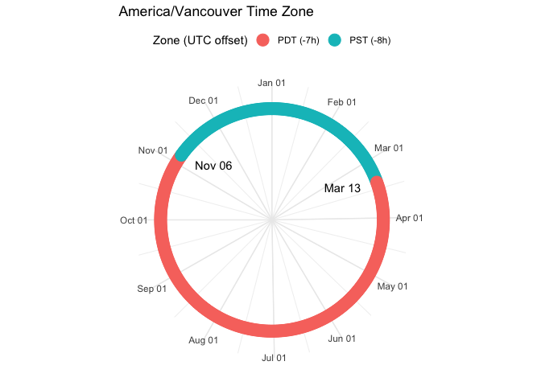

<!-- README.md is generated from README.Rmd. Please edit that file -->
<!-- badges: start -->

[](https://github.com/ateucher/lutz/actions/workflows/R-CMD-check.yaml)
[](https://app.codecov.io/github/ateucher/lutz?branch=master)
[](https://cran.r-project.org/package=lutz)
[](https://cran.r-project.org/package=lutz)
<!-- badges: end -->

# lutz (look up time zones)

## Lookup the time zone of coordinates

Input latitude and longitude values or an `sf/sfc` POINT object and get
back the time zone in which they exist. Two methods are implemented. One
is very fast and uses Rcpp in conjunction with source data from
(<https://github.com/darkskyapp/tz-lookup-oss/>). However, speed comes
at the cost of accuracy - near time zone borders away from populated
centres there is a chance that it will return the incorrect time zone.

The other method is slower but more accurate - it uses the sf package to
intersect points with a detailed map of time zones from
[here](https://github.com/evansiroky/timezone-boundary-builder).

## time zone utility functions

**lutz** also contains several utility functions for helping to
understand and visualize time zones, such as listing of world time
zones,including information about daylight savings times and their
offsets from UTC. You can also plot a time zone to visualize the UTC
offset over a year and when daylight savings times are in effect.

## Installation

You can install lutz from CRAN with:

``` r
install.packages("lutz")
```

Or you can install the development version from github with:

``` r
# install.packages("devtools")
devtools::install_github("ateucher/lutz")
```

## Examples

There are two functions in this package for looking up the time zones of
coordinates: `tz_lookup()` which works with both `sf/sfc` and
`SpatialPoints` objects, and `tz_lookup_coords` for looking up lat/long
pairs. Use the `method` argument to choose the `"fast"` or `"accurate"`
method.

### With coordinates. They must be lat/long in decimal degrees:

``` r
library(lutz)
tz_lookup_coords(49.5, -123.5, method = "fast")
#> [1] "America/Vancouver"
tz_lookup_coords(49.5, -123.5, method = "accurate")
#> [1] "America/Vancouver"

tz_lookup_coords(lat = c(48.9, 38.5, 63.1, -25), lon = c(-123.5, -110.2, -95.0, 130))
#> [1] "America/Vancouver"    "America/Denver"       "America/Rankin_Inlet"
#> [4] "Australia/Darwin"
```

### With `sf` objects:

``` r
library(sf)
library(ggplot2) # this requires the devlopment version of ggplot2

# Create an sf object out of the included state.center dataset:
pts <- lapply(seq_along(state.center$x), function(i) {
  st_point(c(state.center$x[i], state.center$y[i]))
})
state_centers_sf <- st_sf(st_sfc(pts))

# Use tz_lookup_sf to find the time zones
state_centers_sf$tz <- tz_lookup(state_centers_sf)
state_centers_sf$tz <- tz_lookup(state_centers_sf, method = "accurate")

ggplot() + 
  geom_sf(data = state_centers_sf, aes(colour = tz)) + 
  theme_minimal() + 
  coord_sf(datum = NA)
```

<!-- -->

### With `SpatialPoints` objects:

``` r
library(sp)
state_centers_sp <- as(state_centers_sf, "Spatial")

state_centers_sp$tz <- tz_lookup(state_centers_sp)

ggplot(cbind(as.data.frame(coordinates(state_centers_sp)), tz = state_centers_sp$tz), 
       aes(x = coords.x1, y = coords.x2, colour = tz)) + 
  geom_point() + 
  coord_fixed() + 
  theme_minimal()
```

<!-- -->

Note that there are some regions in the world where a single point can
land in two different overlapping time zones. The `"accurate"` method
[includes
these](https://github.com/evansiroky/timezone-boundary-builder/releases/tag/2018g),
however the method used in the `"fast"` does not include overlapping
time zones ([at least for
now](https://github.com/darkskyapp/tz-lookup-oss/issues/34)).

We can compare the accuracy of both methods to the high-resolution time
zone map provided by
<https://github.com/evansiroky/timezone-boundary-builder>. This is the
map that is used by `lutz` for the `"accurate"` method, but in `lutz` it
is simplified by about 80% to be small enough to fit in the package.

``` r
## Get the full time zone geojson from https://github.com/evansiroky/timezone-boundary-builder
download.file("https://github.com/evansiroky/timezone-boundary-builder/releases/download/2019a/timezones-with-oceans.geojson.zip",
                destfile = "tz.zip")
unzip("tz.zip", exdir = "data-raw/dist/")
```

``` r
library(lutz)
library(sf)
library(purrr)
library(dplyr)

tz_full <- read_sf("data-raw/dist/combined-with-oceans.json")
# Create a data frame of 500000 lat/long pairs:
set.seed(1)
n <- 500000
ll <- data.frame(id = seq(n), lat = runif(n, -90, 90), lon = runif(n, -180, 180))
ll_sf <- st_as_sf(ll, coords = c("lon", "lat"), crs = 4326)

# Overlay those points with the full high-resolution time zone map:
ref_ll_tz <- sf::st_join(ll_sf, tz_full)

# Combine those that had overlapping time zones
ref_ll_tz <- ref_ll_tz %>% 
  st_set_geometry(NULL) %>% 
  group_by(id) %>% 
  summarize(tzid = paste(tzid, collapse = "; "))

# run tz_lookup with both `"fast"` and `"accurate"` methods and compare with 
# the time zones looked up with the high-resolution map:
tests <- map_df(c("fast", "accurate"), ~ {
  time <- system.time(test_ll_tz <- tz_lookup(ll_sf, method = .x, warn = FALSE))
  comp <- ref_ll_tz$tzid == test_ll_tz
  matches <- sum(comp, na.rm = TRUE)
  mismatches <- sum(!comp, na.rm = TRUE)
  list(
    method = .x,
    time = time["elapsed"],
    matches = matches,
    mismatches = mismatches,
    accuracy = matches / (matches + mismatches),
    ref_nas = sum(is.na(ref_ll_tz$tzid)),
    fun_nas = sum(is.na(test_ll_tz))
    )
})
```

``` r
knitr::kable(tests)
```

## time zone utility functions

### `tz_plot()`

``` r
tz_plot("America/Vancouver")
```

<!-- -->

### `tz_offset()`

``` r
# A Date object
tz_offset(Sys.Date(), "Africa/Algiers")
#>          tz_name  date_time zone is_dst utc_offset_h
#> 1 Africa/Algiers 2023-10-17  CET  FALSE            1


# A Date-like character string
tz_offset("2017-03-01", tz = "Singapore")
#>     tz_name  date_time zone is_dst utc_offset_h
#> 1 Singapore 2017-03-01  +08  FALSE            8


# A POSIXct date-time object
tz_offset(Sys.time())
#> Warning: You supplied an object of class POSIXct that does not have a time zone
#> attribute, and did not specify one inthe 'tz' argument. Defaulting to current
#> (America/Vancouver).
#>             tz_name           date_time zone is_dst utc_offset_h
#> 1 America/Vancouver 2023-10-17 12:11:11  PDT   TRUE           -7
```

### `tz_list()`

``` r
tz_list() %>% 
  head(20) %>% 
  knitr::kable()
```

|     | tz_name            | zone | is_dst | utc_offset_h |
|:----|:-------------------|:-----|:-------|-------------:|
| 1   | Africa/Abidjan     | GMT  | FALSE  |            0 |
| 2   | Africa/Accra       | GMT  | FALSE  |            0 |
| 3   | Africa/Addis_Ababa | EAT  | FALSE  |            3 |
| 4   | Africa/Algiers     | CET  | FALSE  |            1 |
| 5   | Africa/Asmara      | EAT  | FALSE  |            3 |
| 6   | Africa/Asmera      | EAT  | FALSE  |            3 |
| 7   | Africa/Bamako      | GMT  | FALSE  |            0 |
| 8   | Africa/Bangui      | WAT  | FALSE  |            1 |
| 9   | Africa/Banjul      | GMT  | FALSE  |            0 |
| 10  | Africa/Bissau      | GMT  | FALSE  |            0 |
| 11  | Africa/Blantyre    | CAT  | FALSE  |            2 |
| 12  | Africa/Brazzaville | WAT  | FALSE  |            1 |
| 13  | Africa/Bujumbura   | CAT  | FALSE  |            2 |
| 14  | Africa/Cairo       | EET  | FALSE  |            2 |
| 16  | Africa/Cairo       | EEST | TRUE   |            3 |
| 17  | Africa/Casablanca  | +01  | TRUE   |            1 |
| 18  | Africa/Casablanca  | +00  | FALSE  |            0 |
| 19  | Africa/Ceuta       | CET  | FALSE  |            1 |
| 20  | Africa/Ceuta       | CEST | TRUE   |            2 |
| 21  | Africa/Conakry     | GMT  | FALSE  |            0 |
